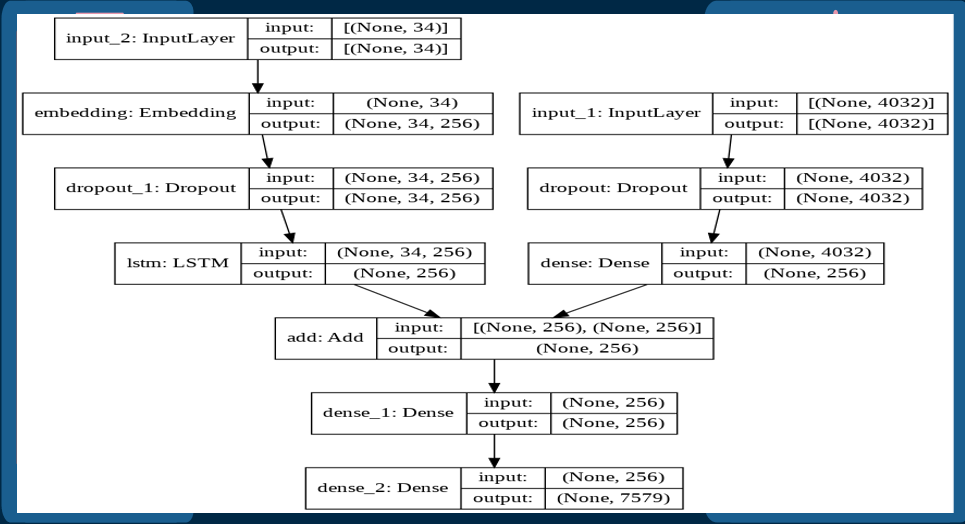
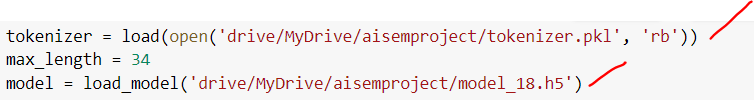
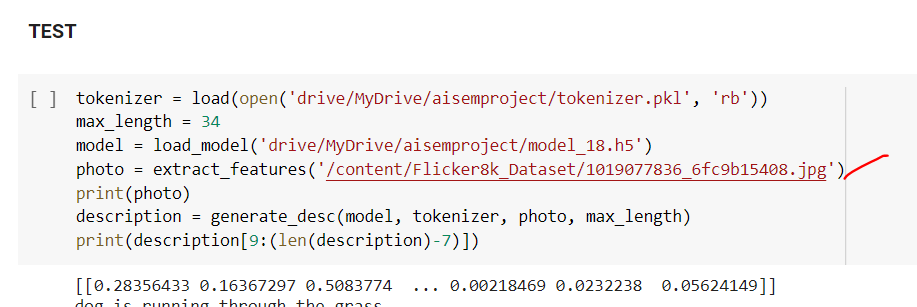
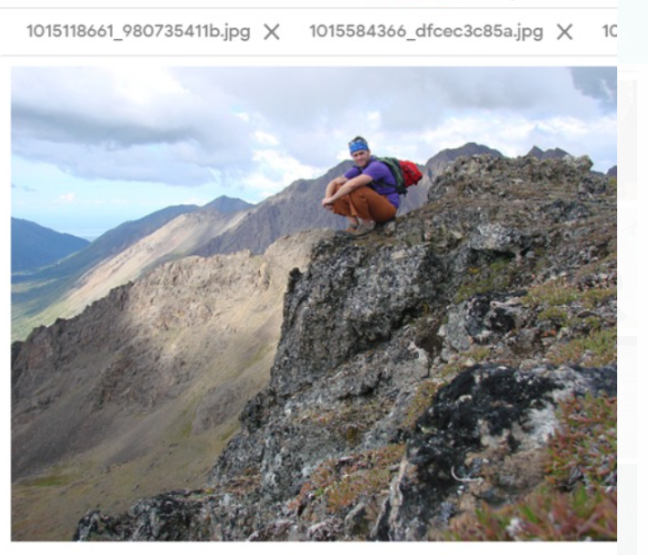
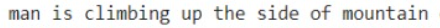

# IMAGE CAPTION GENERATOR

## Problem Statement

This project aims at presenting a model to generate natural language descriptions of images along with  their regions learn about inter-modal correspondences between language and visual data. Such model would have multifarious applications ranging from editing and virtual assistants to social media applications helping next gen robots to take decisions making  applications to assist blind people.

Image captioning means to automatically generate natural language descriptions/captions of different input images.
Very challenging task to perform as it requires expertise and research in both fields computer vision and NLP(Natural Language processing).

## OUR MODEL:
## DATA SET:
* FLICKER DATA
* FLICKER TEXT DATA

## FEATURE EXTRACTIONS FROM DATA SET:
## PHOTO DATA PREPARATION:

* Pretrained NASNetLarge model is used by  nasnet class through keras for object  detection from the dataset.

## TEXTDATA PREPARATION:
* Removing id no from the descriptions (Flicker8k.token.txt) 
* Cleaning the descriptions
* Convert clean descriptions to vocabulary

## The Process:
* Our model generates 1 word at a time.
* The sequence of previous generated word is provided as an input with the photo features to predict the next word.
* We need first word to start generation process (seqstart) and last word to signal the end caption (endseq)

## TRAINING THE MODEL:
* Description text encoded to integers using tokenizer class from keras.
* Each description is splitted into words and provided one word to the model to generate the next word and so on till the endseq during training time.
* To generate model descriptions each predicted word is then again provided back to the model recursively to predict the whole caption for the image

## MODEL
* Photo features+encodedtext=Encoded Next word

## ARCHITECTURE

## STEPS:
* NASnetLarge –produce vector of 4032 processed by dense layer to produce 256 element representation of photo.
* The sequence processor models expects input in a predefined length(34 words).
* Predefined length input is fed into an embedding layer that uses a mask to ignore padded value followed by an LSTM layer with 256 memory units
* Both input models produce 256 element vector.
* Both input models uses regularization with 50% drop out
* Decoder merges vector from both input models using addition operation which is fed to a dense 256 layer & final densed layer respectively. This results into prediction over the entire output vocabulary for the next word in sequence.

## CODE:

## GUIDE:
## For Training and Testing:
* Open the link
* Run 1st 2 cells for downloading the necessary data set.And unzip them by using 3 and 4 cells.
* Now you are good to go and now run all the remaining cells for training and then testing the data.

## For Testing only:
* Open the link 
* Go to the section "Testing The Model" do the necessary imports.
* Upload and place the model_18.h5 file and tokenizer.pkl in your directory.or upload them in your googledrive and link your google drive with colab.
* Update the directories

* Input any file

* And you will get the results

* Link for <a href="https://drive.google.com/file/d/1pXAjZe2yQAq6fG_XIsI6V8X7L6aeXuIi/view?usp=sharing" target='_blank'> model_18.h5 </a>
* Link for <a href="https://drive.google.com/file/d/1pXAjZe2yQAq6fG_XIsI6V8X7L6aeXuIi/view?usp=sharing" target='_blank'> tokenizer.pkl </a>

## Results:

## GENERATED DESCRIPTION:

